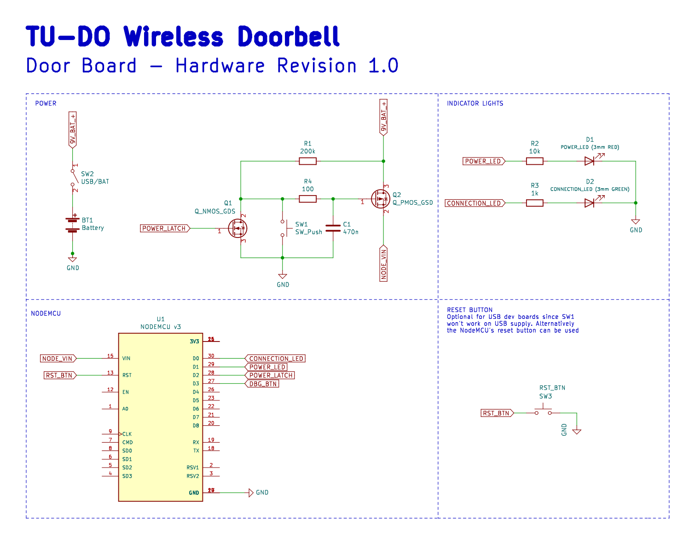

# TU-DO Wireless Doorbell

A wireless doorbell based on the ESP8266

## Overview

The TU-DO Wireless Doorbell is an open source and open hardware doorbell which runs over WiFi. The project utilizes the ESP8266 microcontroller, and includes two boards, one for the doorbell button and the other for the receiver.

## Doorbell Board

The doorbell board (also refered to as the "Door" board) is designed to be placed at the door and features a button to trigger the doorbell ring. It is powered by a 9V battery for easy installation.

The circuit of the doorbell board consists of:
- A button for triggering the doorbell ring
- Two indicator LEDs (one red and one green)
- An ESP8266 microcontroller
- A 9V battery
- A MOSFET power latch

When the ring button is pressed, power is supplied to the ESP8266 and the power latch is activated. The ESP8266 then connects to the WiFi network and sends a TCP packet to all receivers. After successful transmission, the power latch is unlatched and the device fully powers down. With normal usage, a 9V battery should last for multiple months.

During normal operation, the two indicator LEDs provide the following feedback to the user:
- The red LED indicates that the ESP8266 is powered
- The green LED indicates a successful transmission of the TCP packet

In case of an error however, the indicators are used for troubleshooting and will flash in a specific pattern, as described in the following table:

| LED Flash Pattern 				| Error 											|
|-----------------------------------------------|-----------------------------------------------------------------------------------------------|
| Power LED flashes 6x, Connection LED Off 	| Invalid `DoorCFG` provided (This can only occur if the Firmware code has been modified) 	|
| Power LED & Connection LED flash 3x 		| WiFi connection failed 									|
| Power LED flashes 3x, Connection LED Off 	| Failed to ring all Bells (Receivers) 								|
| Power LED & Connection LED flash 3x 		| Some, but not all Bells (Receivers) rang 							|
| Power LED & Connection LED flash alternately 	| `Door` class object improperly initialized (This can only occur if the Firmware code has been modified) |

For further debugging, the ESP8266 will also print a detailed log over the USB serial monitor at `115200` baud.

### Receiver Board

One or more receiver boards (also refered to as the "Bell" boards) are placed at locations where the doorbell ring is to be heard, and feature a buzzer for playing the doorbell ringtone. The receiver is continuously powered by a 5V-12V power supply and acts as a server, waiting for TCP packets from the doorbell board.

The circuit of the receiver board consists of:
- A buzzer for playing the doorbell ringtone
- A red power indicator LED
- A white ring indicator LED
- An ESP8266 microcontroller
- An optional power MOSFET (for driving a higher voltage ring indicator light, which would require a higher voltage power supply such as 12V)

When the ESP8266 on the receiver board receives a TCP packet from the doorbell board, it will play the doorbell ringtone on the buzzer and flash the white ring indicator LED to provide visual feedback.

Additionally, if an error occurs, the ring indicator LED and the buzzer are used for troubleshooting, as described in the following table:

| LED Flash Pattern 				   	    | Error 												      |
|-----------------------------------------------------------|---------------------------------------------------------------------------------------------------------|
| LED continously flashes slowly, Buzzer is silent	    | No WiFi connection, the device is attempting to (re-)connect to the WiFi network			      |
| LED continously flashes quickly (250ms), Buzzer is silent | Invalid `BellCFG` provided (This can only occur if the Firmware code has been modified) 		      |
| LED continously flashes quickly (250ms), Buzzer beeps	    | `Bell` class object improperly initialized (This can only occur if the Firmware code has been modified) |

For further debugging, the ESP8266 will also print a detailed log over the USB serial monitor at `115200` baud.

## Gerbers, BOMs, and Assembly

The Gerber files for the doorbell and receiver boards can be found in the `kicad/(BOARD)/gerbers` folder. An Interactive Bill Of Materials (IBOM) for the Door board is available [here](https://TU-DO-Makerspace.github.io/Wireless-Doorbell/door-ibom.html) and for the Bell board [here](https://TU-DO-Makerspace.github.io/Wireless-Doorbell/bell-ibom.html). These provide not only a list of all components, but also a visual representation of the PCB layout, showing where each component is placed. This can be particularly useful during the assembly process.

The PCB design utilizes many JST connectors, making it easy to incorporate the device into a variety of enclosures. If you have access to a 3D printer, you can also print the enclosures provided in the `STL` folder.

## Configuring the Firmware and Flashing the Boards

The firmware for the doorbell and receiver boards has been written using PlatformIO, and it is highly recommended to use it for flashing the boards. Before flashing the firmware, you need to configure all necessary settings such as WiFi credentials, the static door IP, the number of receivers, etc. in the `src/config.h` header file.

> **Important Note on IP Addresses:** The current version of the firmware requires all boards to have a static IP address, and the IP addresses of the receiver boards must be incremented after the doorbell board's IP. For example, if the doorbell board has IP `192.168.0.20`, the first receiver board must have IP `192.168.0.21`, the second receiver board must have IP `192.168.0.22`, and so on.

The IP addresses for the receiver boards can be configured in the [platformio.ini](platformio.ini) file. Currently, the targets are set up for the TU-DO Makerspace's network, but they can easily be changed to match your own setup.

To flash the boards, follow these steps:
1. Select the corresponding target in PlatformIO.
2. Remove the ESP8266 from the board that you wish to flash.
3. Connect the ESP8266 to your computer.
4. Click the upload button in PlatformIO.

> Note: Flashing the ESP8266 while it is inside the board may not work properly, so it is recommended to remove the ESP8266 from the board before flashing.

## Firmware Structure

The firmware code is organized in the `src` folder and is comprised of three main parts: `bell`, `door`, and `common`. The code for the doorbell and receiver boards is located in the `bell` and `door` folders, respectively, while code shared between the two is stored in the `common` folder.

> Note: A PDF of the class diagram can be found [here](pdf/ClassDiagram.pdf).

The firmware was written in an object-oriented manner and heavily utilizes state machines. Each device is controlled by a main class such as `Door` for the doorbell and `Bell` for the receiver. These classes are then made up of subclasses that handle smaller tasks, such as the `Buzzer` class that manages the buzzer on the receiver and the `RingSender` class that handles the sending of TCP packets from the doorbell.

> Note: A PDF of the state diagram can be found [here](pdf/StateDiagram.pdf).

The codebase also generates a doxygen documentation that can be found [here](https://TU-DO-Makerspace.github.io/Wireless-Doorbell).

To fully comprehend the code, we highly recommend reading the comments within the code as well as consulting the doxygen documentation. Although we've endeavored to make the code self-explanatory and provided ample comments, feel free to reach out if you have any questions by opening an issue (make sure to include "QUESTION" in the issue title).

## License

The TU-DO Wireless Doorbell firmware is licensed under the GPLv3 license. The hardware is licensed under the TAPR Open Hardware License v2.0.

